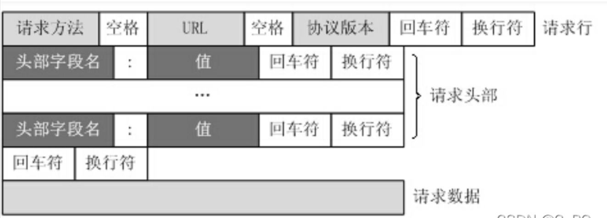
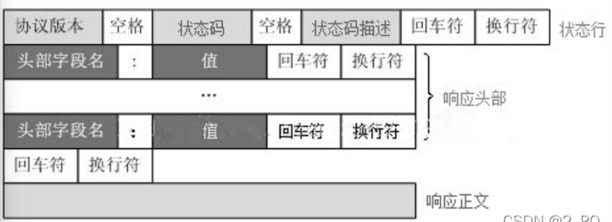
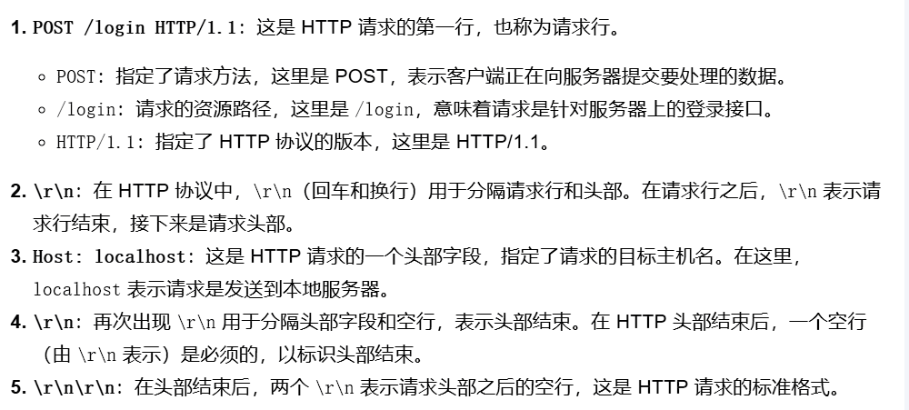

### TinyWebserver项目记录
#### 日志模块
1. 功能：负责记录服务器运行日志，支持异步日志和文件写入。
2. 开发思路
   1. 使用单例模式，确保日志系统全局唯一
   2. 日志写入分为同步和异步，异步使用日志队列和专用线程处理
   3. 对于异步写入采用阻塞队列的形式（生产者与消费者模块）
   4. 日志时间采用time库
3. 开发流程
   1. 使用std::unqiue_lock的方式代替封装的locker中所使用的pthread_mutex_lock
   
   2. 定义阻塞队列block_queue，用于日志异步写入（入队、出队等基本操作采用生产者和消费者）
   3. 定义 Log 类，提供初始化方法
   4. 提供日志接口，如 write_log 和 flush等
      1. 可变参数列表（解析日志内容）
   5. 定义日志等级，分等级进行日志记录
4. 测试功能（google test）
   1. 测试block_queue功能
   2. 日志初始化、同步写、异步写等功能
   3. 测试问题异步写入问题（异步写入函数逻辑问题，导致队列为空时程序卡死）
      1. 修改异步函数逻辑（加入条件变量）
      2. 在程序析构时确保日志队列没有内容
      3. 在flush中加入异步写入的等待
   4. 异步写入时间问题
      1. 在刷新函数中加入了等待确保内容以及被写入

#### 线程池模块
1. 功能：负责任务调度（多线程下高效处理HTTP请求，避免每次都要创建和销毁线程）
2. 思路
   1. 通过任务队列和条件变量管理线程
   2. 每个线程循环从任务队列中取任务、执行、等待
   
3. 开发流程
   1. 初始化线程池（创建线程）
   2. 任务队列管理（向任务队列添加任务）（任务队列采用生产者消费者模型）
   3. 线程从任务队列取任务执行
      1. Reactor模式：同时接收多个服务请求，并且依次同步的处理它们的事件驱动程序；
      2. Proactor模式：异步接收和同时处理多个服务请求的事件驱动程序；
4. 测试功能（google test）
   1. 

#### 数据库连接池
1. 功能：用于管理数据库连接，减少频繁创建和销毁连接的开销
2. 思路
   1. 采用单例模式确保全局只有一个数据库连接池实例
   2. 采用RALL模式来管理数据库连接的生命周期，确保在异常发生时连接能够被正确释放
      1. 把资源和对象的生命周期绑定，对象创建获取资源，对象销毁释放资源
3. 开发流程
   1. 创建数据库连接池
   2. 初始化数据mysql数据库（最大连接数、要连接的数据库信息）
   3. 采用单例模式，保证全局只有一个数据库连接池对象
   4. 获取数据库连接、释放数据库连接、销毁数据库连接等方法
   5. 采用rall设计思想将数据库连接池资源与对象进行绑定
4. 测试功能（google test）
   1. 

#### buffer模块设计
1. 功能：存储接收数据、拼接响应数据（拼接头部和正文）、减少内存分配、统一数据管理
2. 思路
   1. 将vector数组分成三段，预留区、可读区、可写区
   2. 记录各个区起始地址的变换，以此记录数据的写入和读取
   3. 读写函数采用readv、write
3. 开发流程
   1. **读取数据,如果一次超出，超出部分先放到额外缓存区，追加进buffer中**
4. 测试功能（google test）

#### http连接模块
1. 功能：实现读取请求、解析请求、生成响应、发送响应
2. 思路
   1. HTTP请求解析
      1. **一个请求报文由请求行、请求头部、空行和请求数据4部分组成**
      
   2. 文件映射模块
   3. 生成HTTP响应
      1. **一个响应由状态行、响应头部、空行和响应数据4部分组成**
      
      2. 将键值对的参数用&连接起来，如果有空格，将空格转换为+加号；有特殊符号，将特殊符号转换为ASCII HEX值(POST请求编码格式 application/x-www-form-urlencoded)
      [Post编码](https://blog.csdn.net/u013258447/article/details/101107743)
      
   4. epoll（等待队列、就绪队列、红黑树用于创建、修改和删除）高效的I/O事件通知机制
      1. LT模式
         1. socket接收缓冲区不为空 ，说明有数据可读， 读事件一直触发
         2. socket发送缓冲区不满 ，说明可以继续写入数据 ，写事件一直触发
      2. ET模式
         1. socket的接收缓冲区状态变化时触发读事件，即空的接收缓冲区刚接收到数据时触发读事件（从无到有）
         2. socket的发送缓冲区状态变化时触发写事件，即满的缓冲区刚空出空间时触发读事件（从有到无）
   5. http_conn模块的readbuffer、writebuffer
      1. readbuffer : 用于从客户端读取 HTTP 请求数据(buffer设计动态管理readpos、writepos)
      2. writebuffer: 用于存放从 HTTP 响应生成的数据(buffer设计动态管理readpos、writepos)
3. 开发流程
   1. http请求模块
      1. parse解析函数、解析请求行、解析请求头、解析请求体
         1. 解析的时候，参考请求头格式进行编写，解析成键值对的形式
         2. 解析的时候要更新缓冲区（buffer）的状态变换
      2. post请求解析
         1. 编码要求转换（根据当前采用的post编码格式）
         2. 核验数据库信息（利用数据库连接池创建数据库实例，查询、插入数据）
   2. http响应模块
      1. 文件路径、状态采用filesystem进行处理（需要满足c++17版本）
      2. 状态码映射、文件后缀映射
      3. 添加状态行、头部字段、内容（这里要将创建的映射空间首地址给出）
      4. 
   3. http连接处理模块
      1. atomic可以保证对共享数据的访问是线程安全的(针对userCount_、close变量)
      2. read、write、process三个函数的实现，read用于从socket文件描述符读取客户端请求数据，write将响应数据写到缓冲区，process是处理流程
4. 测试功能（google test）
   1. 测试http请求模块各个功能
   2. 测试http响应模块各个功能
      1. **内存映射bug**:使用std::unique_ptr<char[]>管理mmap返回的指针时候，出现内存泄露问题
         1. 因为std::unique_ptr<char[]>在析构的时候尝试用delete[]释放，而 mmap 的内存应该通过 munmap 释放
         2. 直接采用裸指针char*管理mmap返回的指针，在析构的时候调用munmap释放映射内存
   3. 测试http连接处理模块功能

#### 定时器模块

#### 服务器主模块