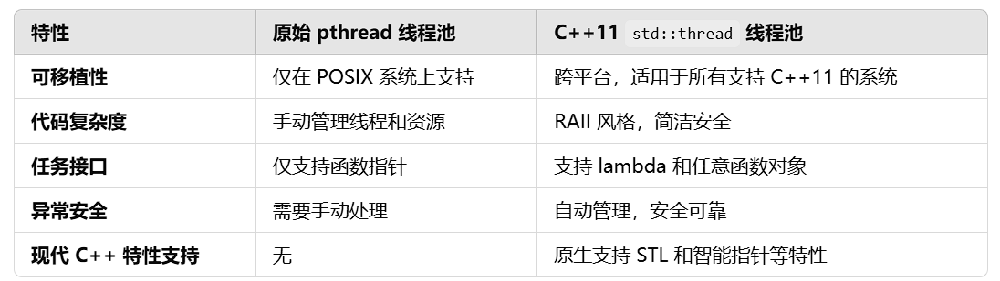

### TinyWebserver项目记录
#### 日志模块
1. 功能：负责记录服务器运行日志，支持异步日志和文件写入。
2. 开发思路
   1. 使用单例模式，确保日志系统全局唯一
   2. 日志写入分为同步和异步，异步使用日志队列和专用线程处理
   3. 对于异步写入采用阻塞队列的形式（生产者与消费者模块）
   4. 日志时间采用time库
3. 开发流程
   1. 使用std::unqiue_lock的方式代替封装的locker中所使用的pthread_mutex_lock
   
   2. 定义阻塞队列block_queue，用于日志异步写入（入队、出队等基本操作采用生产者和消费者）
   3. 定义 Log 类，提供初始化方法
   4. 提供日志接口，如 write_log 和 flush等
      1. 可变参数列表（解析日志内容）
   5. 定义日志等级，分等级进行日志记录
4. 测试功能（google test）
   1. 测试block_queue功能
   2. 日志初始化、同步写、异步写等功能
   3. 测试问题异步写入问题（异步写入函数逻辑问题，导致队列为空时程序卡死）
      1. 修改异步函数逻辑（加入条件变量）
      2. 在程序析构时确保日志队列没有内容
      3. 在flush中加入异步写入的等待
   4. 异步写入时间问题
      1. 在刷新函数中加入了等待确保内容以及被写入

#### 线程池模块
1. 功能：负责任务调度（多线程下高效处理HTTP请求，避免每次都要创建和销毁线程）
2. 思路
   1. 通过任务队列和条件变量管理线程
   2. 每个线程循环从任务队列中取任务、执行、等待
   
3. 开发流程
   1. 初始化线程池（创建线程）
   2. 任务队列管理（向任务队列添加任务）（任务队列采用生产者消费者模型）
   3. 线程从任务队列取任务执行
      1. Reactor模式：同时接收多个服务请求，并且依次同步的处理它们的事件驱动程序；
      2. Proactor模式：异步接收和同时处理多个服务请求的事件驱动程序；
4. 测试功能（google test）
   1. 

#### 数据库连接池
1. 功能：用于管理数据库连接，减少频繁创建和销毁连接的开销
2. 思路
   1. 采用单例模式确保全局只有一个数据库连接池实例
   2. 采用RALL模式来管理数据库连接的生命周期，确保在异常发生时连接能够被正确释放
      1. 把资源和对象的生命周期绑定，对象创建获取资源，对象销毁释放资源
3. 开发流程
   1. 创建数据库连接池
   2. 初始化数据mysql数据库（最大连接数、要连接的数据库信息）
   3. 采用单例模式，保证全局只有一个数据库连接池对象
   4. 获取数据库连接、释放数据库连接、销毁数据库连接等方法
   5. 采用rall设计思想将数据库连接池资源与对象进行绑定
4. 测试功能（google test）
   1. 
#### http连接模块

#### 定时器模块

#### 服务器主模块