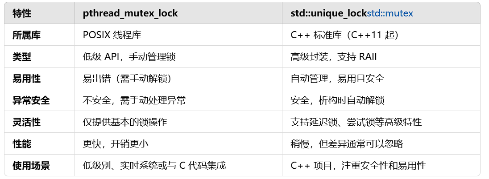

### TinyWebserver项目记录
#### 日志模块
1. 功能：负责记录服务器运行日志，支持异步日志和文件写入。
2. 开发思路
   1. 使用单例模式，确保日志系统全局唯一
   2. 日志写入分为同步和异步，异步使用日志队列和专用线程处理
   3. 对于异步写入采用阻塞队列的形式（生产者与消费者模块）
   4. 日志时间采用time库
3. 开发流程
   1. 使用std::unqiue_lock的方式代替封装的locker中所使用的pthread_mutex_lock
   
   2. 定义阻塞队列block_queue，用于日志异步写入（入队、出队等基本操作采用生产者和消费者）
   3. 定义 Log 类，提供初始化方法
   4. 提供日志接口，如 write_log 和 flush等
      1. 可变参数列表（解析日志内容）
   5. 定义日志等级，分等级进行日志记录
4. 测试功能
   1. 测试block_queue功能
   2. 日志初始化、同步写、异步写等功能

#### 线程池模块
1. 功能：负责任务调度（多线程下高效处理HTTP请求，避免每次都要创建和销毁线程）
2. 思路
   1. 通过任务队列和条件变量管理线程
   2. 每个线程循环从任务队列中取任务、执行、等待
3. 开发流程
   1. 
4. 测试功能
   1. 

#### 数据库连接池

#### http连接模块

#### 定时器模块

#### 服务器主模块